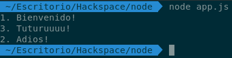
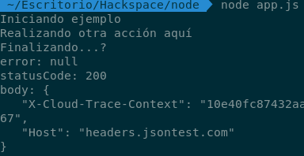
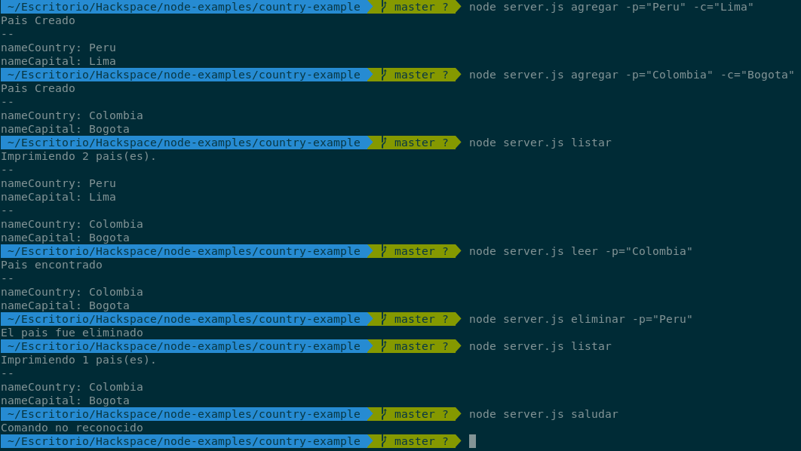
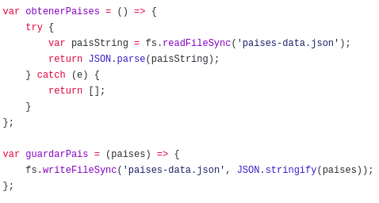
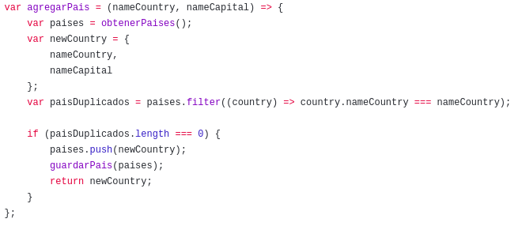

# Callbacks y Sistema de Archivos (File System) `fs`

El módulo `fs` nos proporciona una API para interactuar con el sistema de archivos en nuestra computadora o servidor.

Antes de empezar tenemos que saber algunos conceptos básicos como callbacks y la diferencia entre las funciónes asíncronas y síncronas.

Primero vamos con los callbacks, un callback en resumen es una función que se pasa a otra función como un argumento donde esta se ejecuta para realizar alguna tarea.

```javascript
function saludo(nombre, callback) {
    console.log(`Hola ${nombre}`);
    callback();
}

saludo('Carlos', function(){
    console.log("Bienvenido a Hackspace!");
});
// Hola Carlos
//Bienvenido a Hackspace!


// Tambien pudimos haber declarado una funcion externa de la forma
function bienvenida(){
    console.log("Bienvenido a Hackspace!");
}

saludo('Carlos', bienvenida);
// Hola Carlos
//Bienvenido a Hackspace!
```

Actualmente se está adoptando el uso de la sintaxis ES6 en muchos de los frameworks y nuevas técnologias web por lo que si ves un callback de esta forma no te sorprendas:

```javascript
function saludo(nombre, callback) {
    console.log(`Hola ${nombre}`);
    callback();
}

// Usando arrow functions
saludo('Carlos', () => {
    console.log("Bienvenido a Hackspace!");
});
//Bienvenido a Hackspace!
// Hola Carlos
```

Ambos programas son muy similares, pero existen pequeñas diferencias que hacen ES6 una manera más segura y sencilla de escribir código en JS. Si deseas conocer más acerca de esta sintaxis puedes leer los siguiente enlaces:

* https://carlosazaustre.es/ecmascript-6-el-nuevo-estandar-de-javascript/
* http://exploringjs.com/es6/
* https://github.com/lukehoban/es6features

Ahora vamos a hablar de las funciones asíncronas y por qué su uso se ha vuelto indispensable a la hora de escribir aplicaciones usando node.js.

Para entender un poco qué es una funcion asíncrona vamos a escribir el siguiente programa:

```javascript
console.log("1. Bienvenido!"); 
// Vamos a crear un mensaje que aparezca luego de 3 segundos.
setTimeout(function(){ 
    console.log("2. Adios!");
}, 3000); // Say "Hello again!" 

console.log("3. Tuturuuuu!");
```

Si ejecutamos vemos que nuestro código se ejecuta en orden bastante peculiar, si cambiamos 3000 por 0 vemos que se sigue ejecutando en el mismo orden.

<p align="center">

</p>


Estamos a acostumbrados a escribir programas donde si tenemos las lineas L1 y L2 entonces L2 no puede ejecutarse hasta que L1 se haya ejecutado antes.

Sin embargo con Node.js no tenemos que esperar que la linea L1 termine de ejecutarse para poder correr la linea L2.

<p align="center">

</p>

Esto es útil cuando hacemos llamadas a API's o cuando queremos obtener información de una BD, a veces la respuesta puede demorar o obtener resultados inesperados. 

Esto quiere decir que las funciones asíncronas no bloquean nuestra pila de ejecución y podemos trabajar tranquilamente sin que nuestro programa se detenga en caso de que una linea no termine de ejecutarse.

Ahora vamos con un ejemplo más complejo, para ello vamos a usar una librería llamada  request, la instalamos con:
```bash
npm install request --save
```
Luego ejecutamos

```javascript
// Importamos el modulo request 
const request = require('request');

console.log("Iniciando ejemplo");

request('http://headers.jsontest.com/', (err, res, body) => {
    console.log('error:', err); // Imprime el error si ocurre
    console.log('statusCode:', res && res.statusCode); // Imprima el código de estado de la respuesta si se recibió una respuesta
    console.log('body:', body); // Imprime el cuerpo de la respuesta
});

console.log("Realizando otra acción aquí");
console.log("Finalizando...?");
```
De esta manera podemos aprovechar la naturaleza asíncrona de algunas funciones para poder realizar otras tareas sin bloquear la ejecución de las otras lineas de código.

<p align="center">

</p>

Ahora para entender el reto 2, he subido un ejemplo en el siguiente repositorio:

*https://github.com/HackSpacePeru/node-examples/tree/master/country-example

El cual es muy parecido al reto2:

<p align="center">

</p>

Vamos a explicar como funciona, en la parte del `server.js` no hay mucho que explicar ya que de esto ya se dio un ejemplo en el uso de [yargs](https://github.com/HackSpacePeru/coreupgrade-2018-web/blob/master/yargs.md).

Nos vamos a enfocar en como funciona el modulo `capitales.js`

<p align="center">

</p>

En esta primera parte vemos al método `obtenerPaises()` que obtiene la data del archivo `paises-data.json` y la retorna un array de objetos con cada pais y su respectiva capital.

La razón por la cual usamos `readFileSync` es porque en este ejemplo necesitamos que nuestra operación sea síncrona ya que necesitamos esa data para luego procesarla, además convertimos el búffer que recibimos usando [JSON.parse()](https://developer.mozilla.org/es/docs/Web/JavaScript/Referencia/Objetos_globales/JSON/parse)

El método guardar pais almacena el pais en forma de string usando [JSON.stringify()](https://developer.mozilla.org/es/docs/Web/JavaScript/Referencia/Objetos_globales/JSON/stringify)

<p align="center">

</p>

En esta parte lo que hacemos primero es verificar si ya existe un pais con el mismo nombre antes de agregarlo, para ello hacemos uso del método `filter()`

Para tener una idea de como sabemos si encontramos duplicados usando filter(), si encuentra un elemento entonces el array ya no estará vacio, por ello luego de verificar que `paisDuplicados.length == 0` recien añadimos el país.

```javascript
var users = [
    {
        name: 'Ana',
        code: 20132
    },
        {
        name: 'Julio',
        code: 20123
    },
        {
        name: 'Cesar',
        code: 20161
    }
]

var usersFiltered = users.filter((user) => user.name !== 'Ana');

console.log(usersFiltered); // Esto nos devolvera un arreglo sin el usuario 'Ana'
```

<p align="center">

</p>

En esta ultima parte hacemos uso de la misma técnica de filtrado. Si queremos elimnar un país hacemos un filtrado obteniendo los demás países que no queremos eliminar y guardando ese nuevo arreglo.
