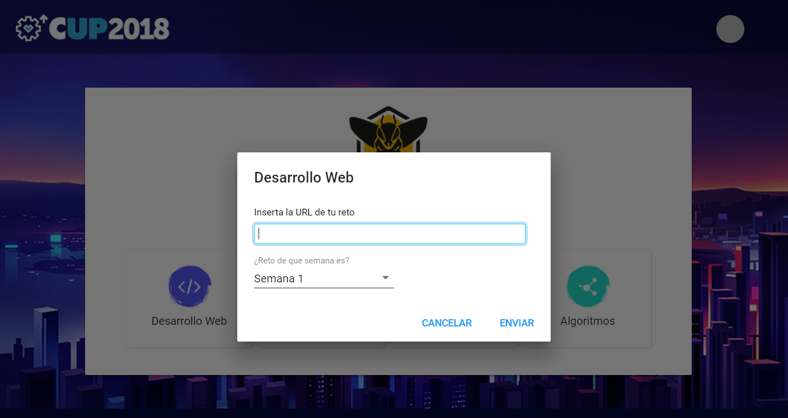

# Reto 1 de Frontend

Este 1er reto de Frontend se trata de maquetación. No queremos que te compliques mucho con el diseño en CSS, pues para eso tendrías que tener una línea gráfica definida. Utiliza el CSS y el HTML para poder crear una estructura como la que te presentamos a continuación (las etiquetas son de HTML5):

Esta maquetación es de una sola página de un blog. Además dentro de cada `<article>`, debes de incluir la siguiente estructura:

No te confundas, no son dos páginas diferentes. La segunda imagen es solo una descripción más a fondo de lo que tiene que tener cada `<article>` dentro de `<main>`

Te recomendamos, para no empezar desde cero, descargarte cualquiera de las 3 opciones que encuentras en el siguiente link:

[http://www.initializr.com/](http://www.initializr.com/)

No te hemos mencionado aún sobre esta herramienta, así que cuando ingreses a la web te recomendamos descargarte la opción `Classic H5BP` para que no te confundan los CSS predefinidos más complejos que pueden tener las otras dos opciones. Aunque si ya tienes alguna noción sobre Twitter Bootstrap, eres libre de utilizarlo ya que te facilitará mucho más el trabajar con la maquetación y el CSS.

Finalmente, no te preocupes por el diseño que puedas ponerle a la página, por ahora solo nos interesa que cumpla con la estructura que te mencionamos.

>PD1: Es recomendable que los anchos los trabajes con porcentajes y no con medidas fijas de pixeles.

>PD2: Si se te hace muy complicado el descargar la plantilla en [Initializer](http://www.initializr.com/), puedes descargarte este repositorio pues ya lo tenemos descargado para ti.

>PD3: Empieza a editar el index.html que te brinda [Initializer](http://www.initializr.com/), justamente una de sus funciones es brindarte una plantilla del HTML y CSS predefinido, para que te concentres en empezar a maquetear.

# Ahora Súbelo a tu Repositorio de Github

Es importante que organices todos tus proyectos como un portafolio y los linkees a Github para que puedan ser vistos por otros.

Si no sabes cómo, sigue las siguiente guía para conocer lo básico de Github: [http://rogerdudler.github.io/git-guide/index.es.html](http://rogerdudler.github.io/git-guide/index.es.html)

Si aún no lo has hecho, crea una carpeta en tu computadora llamada Coreupgrade y `cd` en ella. Esta carpeta albergará todos los proyectos que hagas.

Crea un nuevo repositorio para este proyecto en [GitHub.com](https://www.github.com) y llámalo reto1-web (en lugar de git-test).

Luego mueve ese repositorio a tu máquina local. El comando debería verse como: `git clone https://github.com/YourUserName/reto1-web`

Ahora copia en el directorio del proyecto la página que has maqueteado; configura tu archivo README.md y escribe una breve introducción sobre el proyecto actual y las habilidades que has demostrado una vez que lo hayas completado. (Puedes hacer esto como una autorreflexión al final del proyecto, que es una buena manera de revisar lo que has aprendido).

Si deseas compartir este proyecto, incluya un enlace en el archivo README.md  parecido a esto: Para el [CoreUpgrade](http://www.hackspace.la)

Si tienes problemas, consulta:
* Otra [guía más especializada de Git](https://git-scm.com/book/es/v1/Empezando) o
Nota: Todos los comandos de Git deben ejecutarse desde la carpeta de su proyecto (¿te olvidaste de ingresar a la carpeta reto1-web?)

Cuando estés construyendo tu proyecto, probablemente terminarás haciendo varios ciclos de `git add` + `git commit` antes de estar listo para subirlo a Github con `git push origin master`.

Si has ingresado `git push origin master` y has escrito tu nombre de usuario y contraseña; y si actualizas la página de GitHub, deberías ver nuevos archivos agregados a tu cuenta de GitHub.

# Viendo tu proyecto en la web

Ahora, para mostrar tu trabajo (el proyecto), y enviar tu reto solucionado, tendrás que publicar tu sitio para que otros puedan acceder a él desde la web, en lugar de solo en tu máquina local. La buena noticia es que si tienes tu proyecto en github (como se describe arriba) hacerlo es increíblemente simple. Aquí hay un par de opciones, ambas con sus propios pros y contras.

## Opción 1: `github-pages`

Github te permite publicar proyectos web directamente desde un repositorio de Github. Hacer esto le permitirá acceder a su proyecto desde `your-gh-username.github.io/your-github-repo-name`
Hay un par de formas de hacerlo, pero la más simple es esta:
asegúrese de que el archivo html principal de su proyecto se llame `index.html`. Si no es así, deberás cambiarle el nombre.
Ve a tu repositorio github en la web y haz clic en el botón `Configuración`
desplázate hacia abajo hasta encontrar la sección `GitHub Pages`
cambia el `Source` de `none` a `master branch` y haz click en `Save(Guardar)`.
Normalmente toma unos minutos (el sitio web de GitHub dice hasta 10) pero tu proyecto debe ser accesible a través de la web desde `your-gh-username.github.io/your-github-repo-name` (obviamente sustituyendo sus propios detalles en el enlace)

## Opción 2: `rawgit`

Rawgit.com es otra opción para ver proyectos de github en línea. Es más simple y rápido, pero menos permanente, probablemente menos confiable que `gh-pages`, y no obtiene el beneficio de una buena URL personalizada. Dicho esto, por enviar rápidamente a alguien una vista previa de algo que no está listo para publicar oficialmente, funciona muy bien.
* Ve a sitio web: [Rawgit.com](http://rawgit.com/)
* Pega en la url el archivo html principal de tu repo en github (probablemente index.html)
* Copia y usa uno de los enlaces provistos para compartir tu proyecto.

### Entrega tu reto

Finalmente solo debes enviar cualquiera de estos links donde se aprecia tu página web dentro el formulario que está disponible cuando te logueas en el [CoreUpgrade](https://www.hackspace.la).

Puedes enviar tu reto más de una vez por si lo mejoras:

