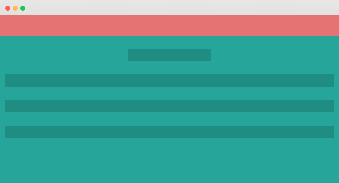
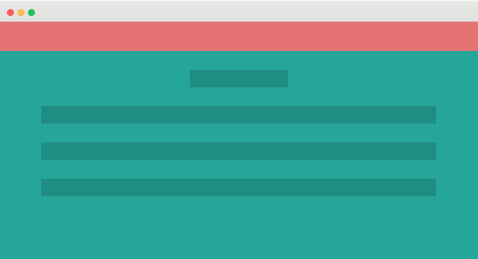

# Conociendo el Grid System de Materialize

### Documentación

La documentación específica para esta sección la encuentras [aquí](http://materializecss.com/grid.html).

### Grid System
Su traducción literal sería Sistema de Grillas, pero mejor no tratemos de traducirlo. Específicamente en Materialize se utiliza el tradicional sistema de 12 columnas, en el que, sin importar el ancho de la pantalla, se considera que esta se divide en 12 columnas. De esta manera, podemos agrupar y maquetear toda la web considerando distribuciones y agrupaciones de estas columnas.

Este es el código básico con el que empezaríamos a trabajar una web en Materialize:

<pre>
&lt;body&gt;
  &lt;div class=&quot;container&quot;&gt;
    &lt;div class=&quot;row&quot;&gt;
        Acá van las columnas, dentro de row.
    &lt;/div&gt;
  &lt;/div&gt;
&lt;/body&gt;
</pre>

Si revisas el link de la documentación del grid system encontrarás que tenemos dos opciones para empezar a trabajar con este:
Esta es una columna sin `.container`dentro del div inicial:

<pre>
&lt;body&gt;
  &lt;div&gt;
    &lt;div class=&quot;row&quot;&gt;
        &lt;div class=&quot;col s12&quot;&gt;&lt;/div&gt;
    &lt;/div&gt;
  &lt;/div&gt;
&lt;/body&gt;
</pre>

Esta es una columna con `.container` dentro del div inicial:

<pre>
&lt;body&gt;
  &lt;div class=&quot;container&quot;&gt;
    &lt;div class=&quot;row&quot;&gt;
        &lt;div class=&quot;col s12&quot;&gt;&lt;/div&gt;
    &lt;/div&gt;
  &lt;/div&gt;
&lt;/body&gt;
</pre>

### Creando Columnas

Para crear una columna y definir su tamaño en un `div`, debemos utilizar uno de los siguiente <b>Prefijos de Clases</b> junto con el número de columnas que deseemos utilizar:

|                   |Dispositivos Móviles  &lt;= 600px|Tablets  &lt;= 992px|Dispositivos de Escritorio  &gt; 992px|
|:-----------------:|:----------------------------------:|:---------------------:|:---------------------------------------:|
|Prefijo de Clase   |`.s`                                |`.m`                   |`.l`                                     |
|Ancho de Contenedor|85%                                 |85%                    |70%                                      |
|Número de Columnas |12                                  |12                     |12                                       |

Descarga el ejemplo aquí: [F-Ejemplo-3.1.zip ( 931 KB )](ejemplos/F-Ejemplo-3.1.zip)

Dentro de la **Sección Central** del `index.htmk` del ejemplo que te acabas de descargar encontrarás el siguiente código:

<pre>
&lt;!--   Secci&#243;n Central   --&gt;
&lt;div class=&quot;container&quot;&gt;
&lt;div class=&quot;row&quot;&gt;
  &lt;div class=&quot;col s12 m4&quot;&gt;
    &lt;div class=&quot;icon-block&quot;&gt;
      &lt;h2 class=&quot;center light-blue-text&quot;&gt;&lt;i class=&quot;material-icons&quot;&gt;flash_on&lt;/i&gt;&lt;/h2&gt;
      &lt;h5 class=&quot;center&quot;&gt;Agiliza el Desarrollo&lt;/h5&gt;

      &lt;p class=&quot;light&quot;&gt;Lorem ipsum dolor sit amet, consectetur adipisicing elit, sed do eiusmod
      tempor incididunt ut labore et dolore magna aliqua. Ut enim ad minim veniam,
      quis nostrud exercitation ullamco laboris nisi ut aliquip ex ea commodo
      consequat. Duis aute irure dolor in reprehenderit in voluptate velit esse
      cillum dolore eu fugiat nulla pariatur. Excepteur sint occaecat cupidatat non
      proident, sunt in culpa qui officia deserunt mollit anim id est laborum.&lt;/p&gt;
    &lt;/div&gt;
  &lt;/div&gt;

  &lt;div class=&quot;col s12 m4&quot;&gt;
    &lt;div class=&quot;icon-block&quot;&gt;
      &lt;h2 class=&quot;center light-blue-text&quot;&gt;&lt;i class=&quot;material-icons&quot;&gt;group&lt;/i&gt;&lt;/h2&gt;
      &lt;h5 class=&quot;center&quot;&gt;Experiencia Enfocada en el Usuario&lt;/h5&gt;

      &lt;p class=&quot;light&quot;&gt;Lorem ipsum dolor sit amet, consectetur adipisicing elit, sed do eiusmod
      tempor incididunt ut labore et dolore magna aliqua. Ut enim ad minim veniam,
      quis nostrud exercitation ullamco laboris nisi ut aliquip ex ea commodo
      consequat. Duis aute irure dolor in reprehenderit in voluptate velit esse
      cillum dolore eu fugiat nulla pariatur. Excepteur sint occaecat cupidatat non
      proident, sunt in culpa qui officia deserunt mollit anim id est laborum.&lt;/p&gt;
    &lt;/div&gt;
  &lt;/div&gt;

  &lt;div class=&quot;col s12 m4&quot;&gt;
    &lt;div class=&quot;icon-block&quot;&gt;
      &lt;h2 class=&quot;center light-blue-text&quot;&gt;&lt;i class=&quot;material-icons&quot;&gt;settings&lt;/i&gt;&lt;/h2&gt;
      &lt;h5 class=&quot;center&quot;&gt;F&#225;cil Para Trabajar&lt;/h5&gt;

      &lt;p class=&quot;light&quot;&gt;Lorem ipsum dolor sit amet, consectetur adipisicing elit, sed do eiusmod
      tempor incididunt ut labore et dolore magna aliqua. Ut enim ad minim veniam,
      quis nostrud exercitation ullamco laboris nisi ut aliquip ex ea commodo
      consequat. Duis aute irure dolor in reprehenderit in voluptate velit esse
      cillum dolore eu fugiat nulla pariatur. Excepteur sint occaecat cupidatat non
      proident, sunt in culpa qui officia deserunt mollit anim id est laborum.&lt;/p&gt;
    &lt;/div&gt;
  &lt;/div&gt;

&lt;/div&gt;
&lt;/div&gt;
</pre>

Verás que los <code>&lt;div class=&quot;col s12 m4&quot;&gt;</code> las clases **s12** y **m4** indican que cuando la pantalla es pequeña o *<b>s</b>mall* (&lt;= 600px) el `div` ocupará las 12 columnas de la pantalla. Pero, si la pantalla es *<b>m</b>ediana* (&lt;= 992px), el `div` ocupará únicamente 4 columnas. Además, como no se está usando ninguna propiedad para pantallas grandes o *<b>l</b>arge*, para pantallas de un tamaño &gt; 992px, se seguirán utilizando las propiedades para pantallas *<b>m</b>edianas*.

Este es un primer ejemplo bastante simple para que puedas ir entendiendo cómo se usa el Grid System de 12 columnas de Materialize.

A continuación un video para que pueda profundizar un poco más:

[Continuar a la siguiente sección](sem3_ejemplos.md)