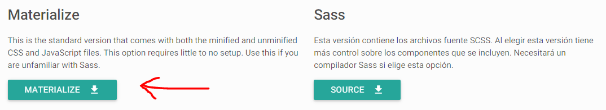

# Conociendo Materialize

### ¿Qué es un Framework para Frontend?
Un framework frontend es un conjunto de recursos y lineamientos para maquetear y diseñar una web. Normalmente comprende una serie de estilos css, íconos, fuentes, colores, animaciones y funciones javascript para hacernos la vida más fácil en lo que se refiere a maquetear y diseñar una web rápidamente.

### Empezando con Materialize
Materialize es uno de los frameworks de frontend más conocidos que utiliza Material Design. Antes de empezar, debemos descargarnos los archivos necesarios. Estos los podemos encontrar en la misma página de Materialize, el link es el siguiente: [Obtener Materialize](http://materializecss.com/getting-started.html)

Al extraer el archivo encontrarás un directorio como el siguiente:

<pre>
materialize/
  |--css/
  |  |--materialize.css
  |  |--materialize.min.css
  |
  |--font/
  |  |--roboto/
  |
  |--js/
  |  |--materialize.js
  |  |--materialize.min.js
  |
  |--LICENSE
  |
  |--README.md
  </pre>

### Configurando el HTML

A continuación, hay que crear el archivo `index.html` dentro de la carpeta `materialize` y nos aseguramos de enlazar los archivos correctamente. Generalmente es aconsejable importar archivos de javascript al final de la etiqueta body para reducir tiempos de carga. Sigue el siguiente ejemplo sobre cómo importar Materialize en una página web.

Una última cosa a tener en cuenta es que tiene que importar jQuery antes de importar materialize.js!

<pre>
&lt;!DOCTYPE html&gt;
&lt;html&gt;
&lt;head&gt;
  &lt;!--Importa la Fuente de Google Icons--&gt;
  &lt;link href=&quot;https://fonts.googleapis.com/icon?family=Material+Icons&quot; rel=&quot;stylesheet&quot;&gt;
  &lt;!--Importa materialize.css--&gt;
  &lt;link type=&quot;text/css&quot; rel=&quot;stylesheet&quot; href=&quot;css/materialize.min.css&quot;  media=&quot;screen,projection&quot;/&gt;

  &lt;!--Haz saberle al navegador que la página está optimizada para móviles--&gt;
  &lt;meta name=&quot;viewport&quot; content=&quot;width=device-width, initial-scale=1.0&quot;/&gt;
&lt;/head&gt;

&lt;body&gt;
  &lt;!--Importa jQuery antes de materialize.js--&gt;
  &lt;script type=&quot;text/javascript&quot; src=&quot;https://code.jquery.com/jquery-3.2.1.min.js&quot;&gt;&lt;/script&gt;
  &lt;script type=&quot;text/javascript&quot; src=&quot;js/materialize.min.js&quot;&gt;&lt;/script&gt;
&lt;/body&gt;
&lt;/html&gt;
</pre>

### Documentación
Todo lo que vamos a necesitar para aprender Materialize lo encontraremos en su página web: [Materialize](http://materializecss.com/)

Sin embargo, no todo está traducido, así que realizaremos algunos ejemplos con las secciones más importantes que necesitas aprender de ella.

[Continuar a la siguiente sección](sem3_gridsystem.md)