<h3> Semana 3 </h3>
<h1> MongoDB </h1>

Luego de crear nuestro web server de manera más eficiente con express, aún nos hace falta almacenar data a través de nuestro servidor, para ello haremos uso de una técnología que con el paso del tiempo ha ido creciendo hasta el punto de convertirse en una de las bases de datos más usadas. Esto no quiere decir que sea la mejor, ya que es muy distinta a las bases de datos más conocidas como MySQL, Oracle o SQL-Server, la gran diferencia entre MongoDB y las mencionadas anteriormente es en el paradigma __"No relacional"__ de esto es que se le conoce como una __"NoSQL"__.

A diferencia de la bases de datos "Relacionales" que usan tablas como estructura básica, MongoDB hace uso de estructuras similares a JSON para almacenar información.

Si deseas saber más acerca de MongoDB puedes visitar el siguiente [enlace](https://www.mongodb.com/es).

## Ventajas de usar MongoDB

En la actualidad la cantidad de data almacenada ha crecido de manera exponencial, se caracterizan por ser grandes, no estructurados y, a veces, difíciles de manejar, esto ha llevado al desarrollo de bases de datos NoSQL.

Las ventajas de usar MongoDB son:

* __Schema less__: MongoDB es una base de datos de documentos en la que una colección contiene diferentes documentos. El número de campos, el contenido y el tamaño del documento pueden diferir de un documento a otro.

* Almacenamiento orientado a documentos: Los datos se almacenan en forma de documento de estilo JSON.

* Sin uniones complejas y alta disponibilidad.

* Capacidad de consulta profunda. MongoDB admite consultas dinámicas en documentos usando un lenguaje de consulta basado en documentos que es casi tan poderoso como SQL, esto permite consultas rápidas.

* Altamente escalable, además utiliza la memoria interna para almacenar el conjunto de trabajo (en ventana), lo que permite un acceso más rápido a los datos.

## ¿Dónde usar MongoDB?

* Big Data
* Gestión de contenido y delivery
* Infraestructura Móvil
* Redes Sociales
* Gestión de datos de usuario
* Hub de datos

## Estructura de una Base de Datos de MongoDB

### Colección

Una colección es un grupo de documentos MongoDB. Es el equivalente de una tabla en un [RDBMS](https://es.wikipedia.org/wiki/Sistema_de_gesti%C3%B3n_de_bases_de_datos_relacionales).

### Documento

Un documento es un conjunto de pares clave-valor. Los documentos tienen un esquema dinámico. El esquema dinámico significa que los documentos en la misma colección no necesitan tener el mismo conjunto de campos o estructura, y los campos comunes en los documentos de una colección pueden contener diferentes tipos de datos.

La siguiente tabla muestra la relación de la terminología RDBMS con MongoDB.

| RDBMS        | MongoDB           |
| ------------- |:-------------:|
| Tabla      | Colección |
| Tupla/Fila      | Documento |
| Columna      | Campo |

Ahora vamos a mostar el ejemplo de un documento:

```javascript
_id: ObjectId(8ef12ew8231c)
titulo: 'Mi primer lenguaje',
autor: 'Kurisu Makise',
contenido: 'El primer lenguaje en el que aprendí a programar fue C++',
fecha: new Date(2018,1,1,2,1),
tags: ['C++','programación'],
likes: 322,
comentarios: [
    {
        usuario: 'Rintarou Okabe',
        mensaje: 'Wow increible!!!',
        fecha: new Date(2018,2,1,3,15),
        likes: 2
    },
    {
        usuario: 'Mayuri Shiina',
        mensaje: 'Tuturuuu',
        fecha: new Date(2018,1,3,4,20),
        likes: 4
    }
]
```
El atributo `_id`, Es creado por MongoDB, tambien puede ser provisto por el usuario.

Ahora vamos a crear una pequeña aplicación usando MongoDB y Node.js para ello vamos a crearnos una cuenta en __mLab__, una plataforma que nos ofrece una BD gratuita en la nube y nos ahorrará el proceso de instalación.

Para crear una cuenta en mLab sigue el siguiente [enlace](https://mlab.com).

Nuestra aplicación será un pequeño TODO list donde guardaremos nuestras tareas para luego leerlas desde nuestra base de datos.

No nos enfocaremos demasiado en los estilos de aplicación así que se va a ver un poco rudimentario.

Iniciaremos nuestra aplicación

```bash
mkdir node-notes-hackspace-app
cd node-notes-hackspace-app
npm init
```

Luego de esto instalaremos algunos paquetes que vamos a usar como express,body-parser, y mongoose para manejar nuestra BD.

```bash
npm install express --save
npm install body-parser --save
npm install mongoose --save
```

Luego de crear una cuenta en mLab y recibir el correo de confirmación hacemos lo siguiente:

Creamos nuestra BD en Create New en MongoDB Deployment:
<p align="center">
    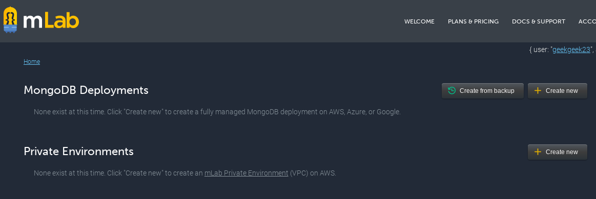
</p>

Luego elegimos a nuestro proveedor en este caso amazon:

<p align="center">
    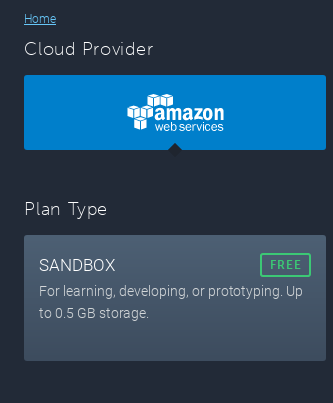
</p>

Nombramos a nuestra BD en mi caso lo terminé llamando todo-list-hackspace ya que no me aceptó todo-list :(
<p align="center">
    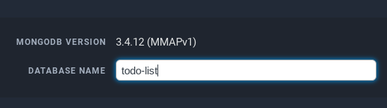
</p>

Luego al final tendremos nuestra BD ya creada:

<p align="center">
    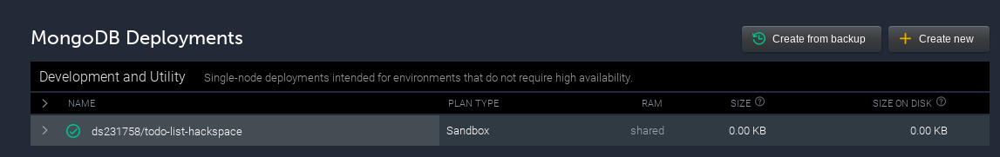
</p>

Si hacemos click en esta instancia veremos que nos dice como conectarnos con nuestra base datos haciendo uso de nuestro usuario y contraseña:

<p align="center">
    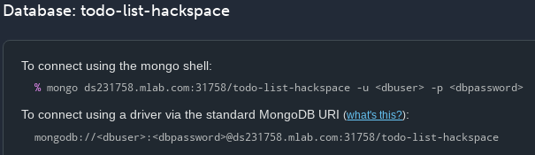
</p>

Antes de ello tenemos que agregar un usuario y contraseña a nuestra BD para ello:

<p align="center">
    
</p>

Vamos a explicar un poco de lo que es [mongoose](http://mongoosejs.com/docs/index.html). Mongoose es una herramienta ODM (Object Document Mapping) para Node.js y MongoDB. Nos ayudará a convertir los objetos de muestro código a documentos en la base de datos y viceversa.


Tambien puedes ver un ejemplo más complejo y completo en la documentación de [Mozilla](https://developer.mozilla.org/en-US/docs/Learn/Server-side/Express_Nodejs/mongoose)

También haremos uso de la herramienta POSTMAN, puedes instalarlo siguiendo el siguiente [enlace](https://www.getpostman.com/).

La estructura de nuestro proyecto tendrá la siguiente forma:

* node-notes-hackspace-app
    - app
        * controllers
            - note.controller.js
        * models
            - note.model.js
    - config
        * database.config.js
    - node_modules
    - public
        * index.html
    - package.json
    - server.js

### Primeros Pasos


Primero vamos a configurar nuestro web-server con express de una forma similar al ejemplo que usamos anteriormente:

Express nuestro web-framework que usaremos para construir nuestra API REST, y body-parser es un módulo que analiza la solicitud (de varios tipos de contenido) y crea un objeto `req.body` al que podemos acceder en nuestras rutas.

Luego , creamos una aplicación express y agregamos dos  middlewares body-parser usando el `app.use()` método de express. Un middleware es una función que tiene acceso a los objetos `request` y `response`. Puede ejecutar y transformar el objeto de solicitud o devolver una respuesta.

Luego, definimos una ruta GET simple que nos llevará a nuestro formulario donde enviaremos nuestras tareas.

Finalmente, escuchamos en el puerto 3000 las conexiones entrantes.

```javascript
// server.js

var express = require('express');
var bodyParser = require('body-parser');

// Creamos nuestra app de express
var app = express();

// parse application/x-www-form-urlencoded
app.use(bodyParser.urlencoded({ extended: true }))

// parse application/json
app.use(bodyParser.json())

app.use(express.static("public"));

app.get("/", function(req, res) {
  res.sendFile(__dirname + "/" + "index.html");
});

app.listen(3000, function() {
  console.log("El servidor web esta corriendo en el puerto 3000...!");
});
```

Nuestro index.html estará asi:

```html
<!DOCTYPE html>
<html lang="en">
<head>
    <meta charset="UTF-8">
    <title>CoreUpgrade 2018</title>
</head>
<body>
    <h1>Bienvenido al CoreUpgrade</h1>

    <h2>Todo-List</h2>

    <form action = "http://localhost:3000/notes" method = "POST">
        Titulo: <input type = "text" name = "title">  <br>
        contenido: <input type = "text" name = "content">
         <input type = "submit" value = "Submit">
    </form>

</body>
</html>
```
### Configuración y conexión a la base de datos

Por seguridad separamos la configuración de nuestra BD en    `/config/database.config.js `, en este archivo tienes que poner tu password y contraseña de mLab

```javascript
// database.config.js
var dbUser = "DBUserMLAB";
var dbPassword = "DBUserMLAB";
module.exports = {
    url: `mongodb://${dbUser} :${dbPassword} @ds231758.mlab.com:31758/todo-list-hackspace`
}
```

Luego de esto, importamos la configuración de base de datos anterior en `server.js` luego de `app.use(express.static("public"))`:

```javascript
// importamos la configuracion de nuestra BD
var mongoose = require('mongoose');
var dbConfig = require('./config/database.config.js');

mongoose.Promise = global.Promise;

mongoose.connect(dbConfig.url, {
	useMongoClient: true
});

mongoose.connection.on('error', function() {
    console.log('No se ha podido conectar a la BD, Saliendo...');
    process.exit();
});
mongoose.connection.once('open', function() {
    console.log("Conectado exitosamente a la BD!");
});
```
Verificamos corriendo nuestro server.js

<p align="center">
    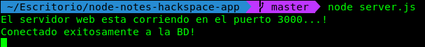
</p>

### Definiendo nuestros modelos

Los modelos se definen usando la interfaz `Schema`. El esquema nos permite definir los campos almacenados en cada documento junto con sus requisitos de validación y valores predeterminados. 

Los esquemas se "compilan" en modelos usando el método `mongoose.model()`. Una vez que terminamos con el modelo, podemos usarlo para buscar, crear, actualizar y eliminar objetos del tipo especificado.

Nuestro modelo será muy sencillo:
``` javascript
// note.model.js
var mongoose = require('mongoose');

// Creamos un schema que guardará en nuestra BD
// la siguiente estructura:
var NoteSchema = mongoose.Schema({
    title: String,
    content: String
}, {
    timestamps: true
});

module.exports = mongoose.model('Note', NoteSchema);
```

Vamos añadir más funcionalidades a nuestra aplicación CRUD (Create, Read, Update, Delete), para ello añadiremos en nuestro controlador los métodos para manejar todas las operaciones CRUD.

Añadimos las siguientes lineas debajo de:
``` javascript
app.get("/", function(req, res) {
  res.sendFile(__dirname + "/" + "index.html");
});
```

``` javascript
// sever.js

var notes = require('./app/controllers/note.controller');

// Creamos una nueva nota
app.post('/notes', notes.create);

// Obtenemos todas las notas
app.get('/notes', notes.findAll);

// encuentra una nota con el noteId
app.get('/notes/:noteId', notes.findOne);

// Actualiza una nota con el noteId
app.put('/notes/:noteId', notes.update);

// Elimina una nota con el noteId
app.delete('/notes/:noteId', notes.deleteNote);
```

Ahora vamos a crear las funcionalidades de nuestra API REST, para ello en el nuevo archivo:

``` javascript
// note.controller.js
// Este modulo es el controlador de nuestra aplicación
var Note = require('../models/note.model.js');

// Crea y guarda una nota en la BD
function create(req, res) {    
    if(!req.body.content) {
        res.status(400).send({message: "La nota no puede estar vacia"});
    }

    var note = new Note({title: req.body.title || "Untitled Note", content: req.body.content});

    note.save(function(err, data) {
        if(err) {
            console.log(err);
            res.status(500).send({message: "Ha ocurrido un error al guardar la nota."});
        } else {
            res.send(data);
        }
    });
};

// Encuentra y retorna todas las notas de la base de datos
function findAll(req, res) {
    Note.find(function(err, notes){
        if(err) {
            res.status(500).send({message: "Ha ocurrido un error al obtener las notas"});
        } else {
            res.send(notes);
        }
    });
};

// Encuentra una nota con el noteId
function findOne(req, res) {
    Note.findById(req.params.noteId, function(err, data) {
        if(err) {
            res.status(500).send({message: "no se ha podido obtener la nota con id " + req.params.noteId});
        } else {
            res.send(data);
        }
    });
};

// Actualiza una nota identificada con el noteId en el request
function update(req, res) {
    Note.findById(req.params.noteId, function(err, note) {
        if(err) {
            res.status(500).send({message: "No se pudo encontrar una nota con id " + req.params.noteId});
        }

        note.title = req.body.title;
        note.content = req.body.content;

        note.save(function(err, data){
            if(err) {
                res.status(500).send({message: "No se pudo actualizar la nota con id " + req.params.noteId});
            } else {
                res.send(data);
            }
        });
    });
};

// Elimina una nota con el ID noteId especificado en el request
function deleteNote(req, res) {
    Note.remove({_id: req.params.noteId}, function(err, data) {
        if(err) {
            res.status(500).send({message: "No se puede eliminar la nota con id " + req.params.id});
        } else {
            res.send({message: "La nota ha sido eliminada exitosamente"})
        }
    });
};

// Exportamos todas nuestras funciones para que puedan ser usadas
module.exports = {
    create,
    findAll,
    findOne,
    update,
    deleteNote
};
```

<p align="center">
    
</p>

Ahora vamos a probar nuestra app para ello corremos nuestro server nuevamente:

```bash
$ node server.js
```

Vamos a nuestro http://localhost:3000 y vemos nuestro formulario:

<p align="center">
    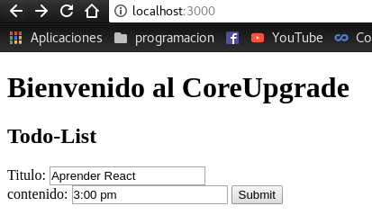
</p>

Enviamos y nos dará un resultado de nuestra nota:

<p align="center">
    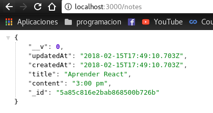
</p>

Vamos a la pagina de mLab y vemos que ya tenemos nuestra colleccion creada, hacemos click sobre esta para inspeccionarla.

<p align="center">
    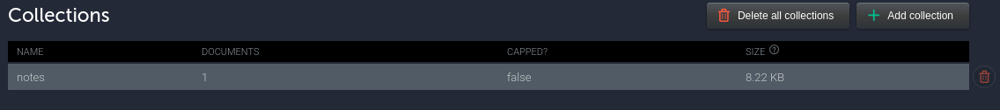
</p>

Vemos que ya se ha creado nuestro documento con la nota que le pasamos y la hora a la que fue creada.

<p align="center">
    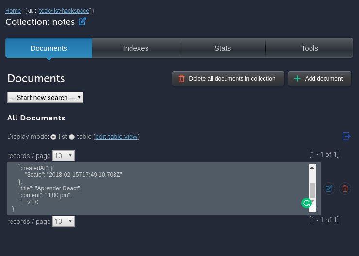
</p>

En mi caso voy a añadir más notas a la BD, ahora vamos a ver si las podemos visualizar todas, para ello voy a hacer uso de __POSTMAN__, una herramienta muy utilizada por los desarroladores para verificar los request y responses de nuestra __API__.

Abrimos POSTMAN y en el campo seleccionamos __GET__ y escribimos la ruta http://localhost:3000/notes y obtenemos todas las notas que hemos escrito en nuestro formulario.

<p align="center">
    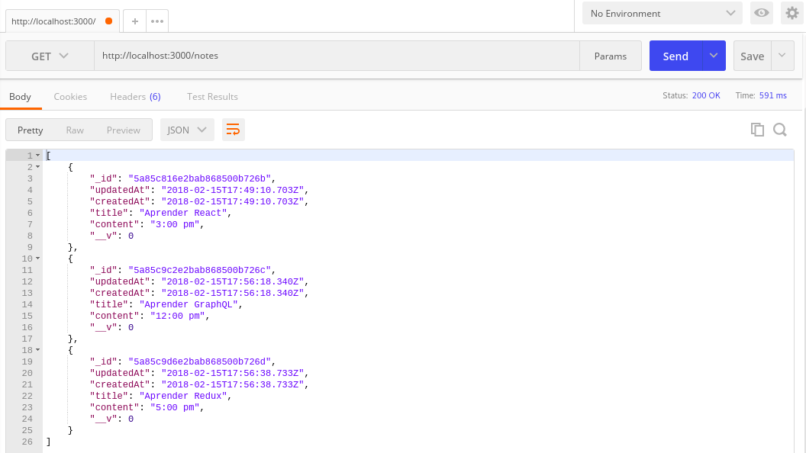
</p>

Ahora vamos a obtener una nota guardada usando el atributo `_id` mediante el método __GET__:

<p align="center">
    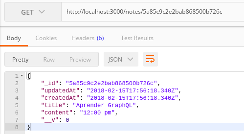
</p>

Probemos actualizando nota guardada usando el atributo `_id` mediante el método __PUT__, para ello en los params, en body, elegimos raw y escribimos los nuevos atributos.

<p align="center">
    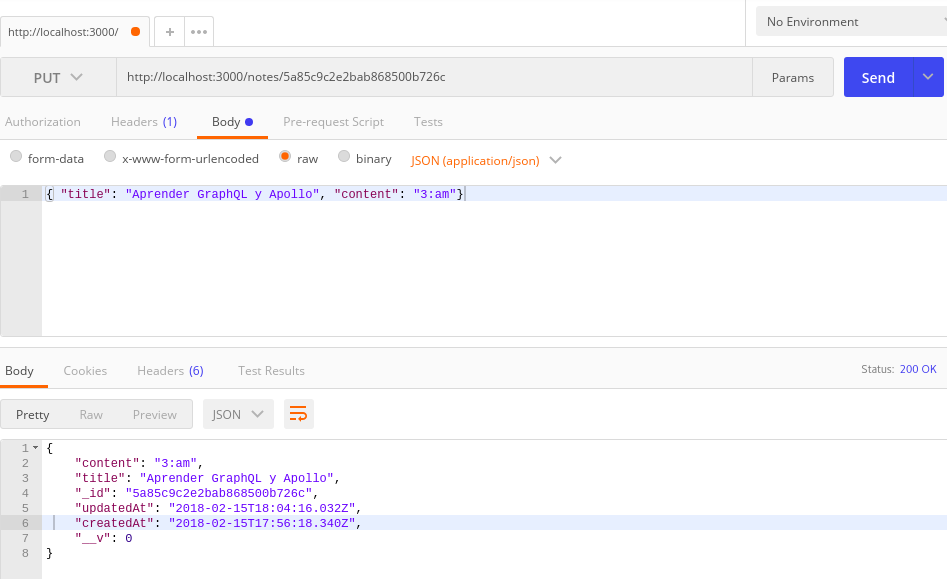
</p>

Finalmente veamos si podemos eliminar una nota mediante su `_id` para ello hacemos uso del método __DELETE__

<p align="center">
    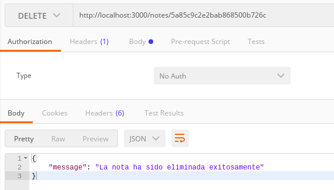
</p>

Verificamos si la nota ha sido eliminada:

<p align="center">
    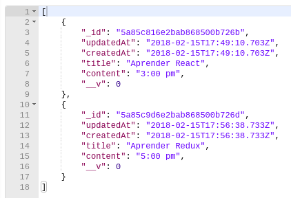
</p>

Si deseas puedes ver el repo completo en el siguiente enlace:

* https://github.com/gersongams/node-notes-hackspace-app