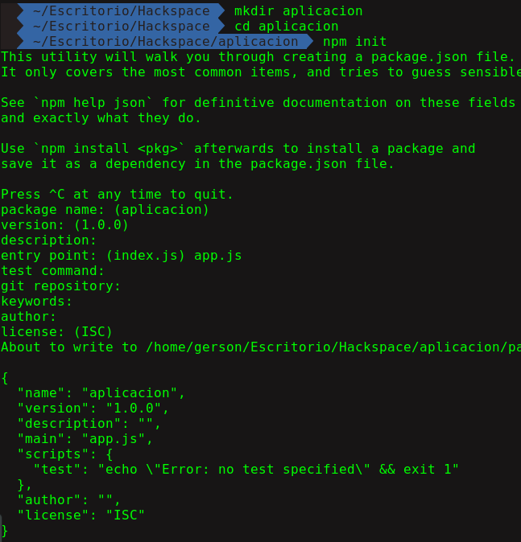
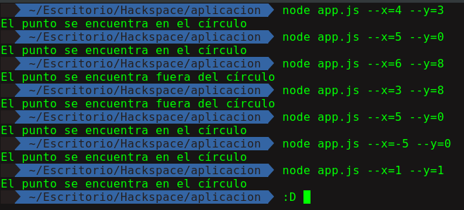
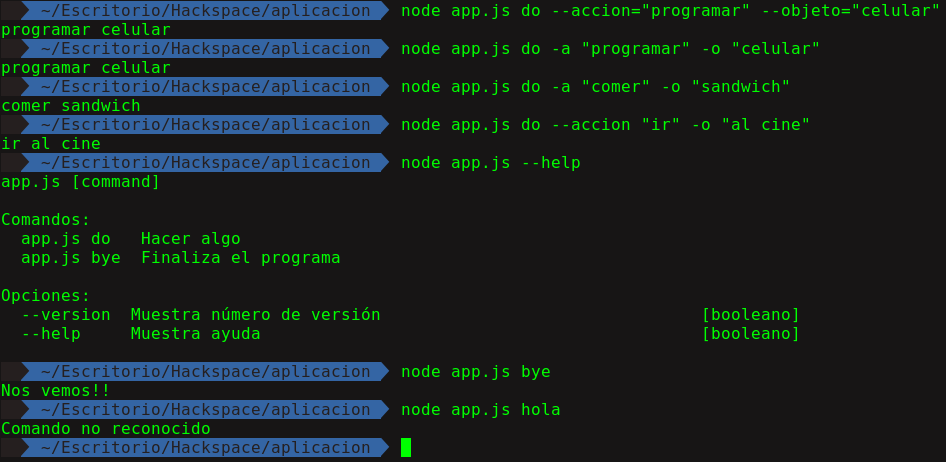

# Yargs

Yargs es una libreria de node.js para construir aplicaciones capaces de leer lineas de comando.

WHAT? THE FUCK?

Hemos estado usando npm para instalar nuestros módulos por ejemplo:

```bash
npm install express --save
```

En este caso npm viene a ser nuestro programa, `install` viene a ser nuestro comando y `--save` una opcion.

Ahora vamos a escribir una aplicación que nos diga si unos puntos se encuentran dentro del circulo de radio 5 donde leera nuestras opciones mediante consola:

```bash
$ node app.js --x=4 --y=3
El punto se encuentra en el círculo
```

Para ello, creamos nuestra aplicación:
```
mkdir aplicacion
cd aplicacion
npm init
```

<p align="center">

</p>

Ahora vamos a instalar yargs en la misma carpeta de nuestra aplicación abrimos la linea de comandos:

```
$ npm install yargs --save
```

Luego de eso creamos nuestra `app.js`

```javascript
// Importamos la libreria yargs
const argv = require('yargs').argv

var ptoX = argv.x;
var ptoY = argv.y;

if ( Math.sqrt(ptoX*ptoX + ptoY*ptoY) <= 5) {
    console.log('El punto se encuentra en el círculo');
} else {
    console.log('El punto se encuentra fuera del círculo');
}
```

Ahora probamos:
<p align="center">

</p>

Ahora vamos a ver un ejemplo más complejo que este, para ello vamos a añadir más opciones a nuestra aplicación de terminal.

Ahora modificaremos un poco nuestro `app.js`:

```javascript
const yargs = require('yargs')

// Vamos a crear un objeto de las acciones a realizar
var actionOptions = {
    describe: 'Accion a realizar', // Esto nos ayudara cuando tipeemos help
    demand: true, // Obligatorio
    alias: 'a' // alias o shorcut
};


const objectOptions = {
    describe: 'Sobre que o quien realiza la accion',
    demand: true,
    alias: 'o'
};

var argv = yargs
                // Aca escribimos los comandos y las opciones
                .command('do','Hacer algo', {
                    accion: actionOptions, // --accion
                    objeto: objectOptions // --objeto
                })
                .command('bye','Finaliza el programa')
                .help() // --help
                .argv;

var command = argv._[0]; // Leemos el primer comando

// Si el comando es do concatena ambas
if (command == 'do'){
    var action = argv.accion;
    var name = argv.objeto;
    console.log(`${action} ${name}`);
}
// Caso contrario nos despedimos
else if(command == 'bye'){
    console.log("Nos vemos!!");
}else{
    console.log("Comando no reconocido");
}
```

Luego hacemos las pruebas de nuestros comandos, y voilá! :D

<p align="center">

</p>
